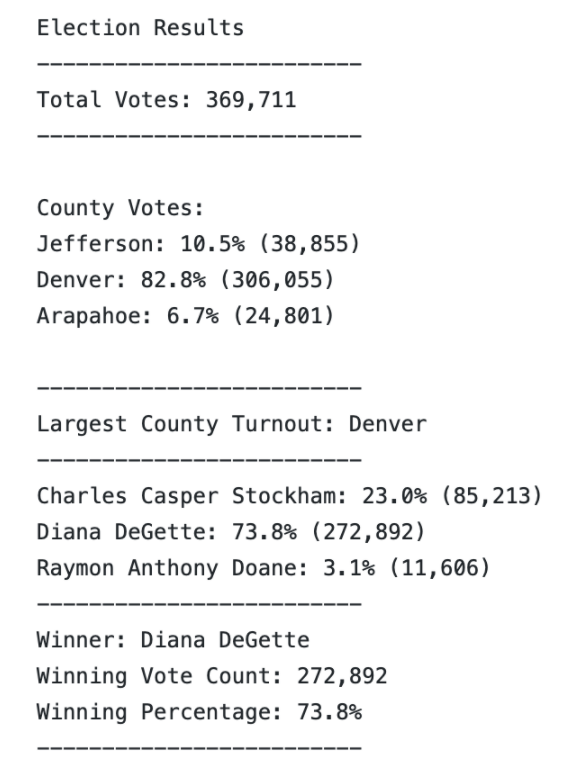

# Election-Analysis
## Overview of Election Audit:
The purpose of this analysis was to develop skills in python that can be applicable in a work setting. For this example, we used Python to take large amounts of raw data, and conduct various analyses to determine the winner of an election in real time. This process allows counties to use repeatable code that can identify % of vote and winner in any election.

## Election-Audit Results: 
As far as the results of the election, there are a few results that standout from the final tally:

### Total Votes
- There were 369,711 total votes cast in the congressional election
### County Facts
- Jefferson County had the 2nd highest % of total votes at 10.5% (38,855)
- Denver County had the largest share of total votes at 82.8% (306,055) 
- Arapahoe County had the smallest % of total votes at 6.7% (24,801)

### Candidate Results 
- Charles Casper Stockham: 23.0% (85,213)
- Diana DeGette: 73.8% (272,892) (WINNER!)
- Raymon Anthony Doane: 3.1% (11,606)

## Election-Audit Summary: 
Based on the results of the election, Diana DeGette was the winner by a large margin! As far as this analysis, Python was a useful tool to help establish a repeatable and automated process to count and certify election results
